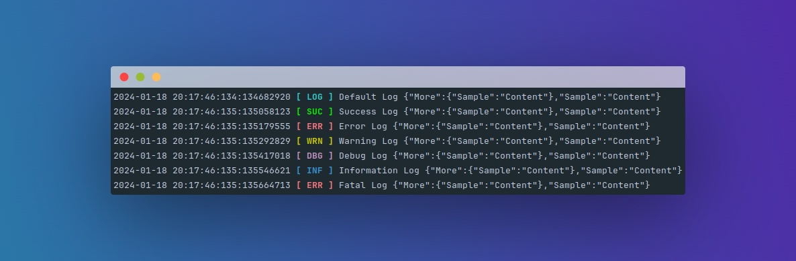

<div align="center">
  <h1>Go Log 2.0</h1>

  <hr>

  <p>A Simple Logging Library for Go Language</p>


</div>

## Introduction

Go Log is a Go library for flexible and customizable logging. It
provides an easy way to log messages to both the terminal and log files.
You can also add color to your terminal log messages for better readability.

### Features

- **Vivid Color Coding**: Experience an intuitive logging interface with color-coded messages in the terminal, making
  log reading more user-friendly and efficient.
- **Dual Format Support**: Flexibly switch between the traditional default format and structured JSON format, catering
  to diverse logging needs.
- **Web-Focused Design**: Tailored specifically for web-based applications, ensuring seamless integration and optimal
  performance in web environments.
- **Broad Platform Support**: Fully compatible with various operating systems including Linux, Unix, and MacOS, ensuring
  consistent functionality across different environments.
- **Diverse Log Levels**: Equip your logging toolkit with a wide range of log levels to suit every scenario:
    - **Log (Default)**: General logs for routine application processes.
    - **Success**: Highlight successful operations and milestones.
    - **Error**: Capture and flag errors in the system.
    - **Warning**: Warn of potential issues or misconfigurations.
    - **Debug**: Facilitate in-depth debugging with detailed insights.
    - **Information**: Provide informational messages about system status.
    - **Fatal**: Report critical issues that require immediate attention.
- **Minimalist Design**: Enjoy a clutter-free, minimalist approach that focuses on performance and ease of use, without
  unnecessary complexities.

## Getting Started

### Installation

To use Go Log in your Go project, you need to install it using Go modules.
You can add it to your project with the following command:

```bash
go get -u github.com/Tvative/Package-Go-Log
```

### Usage

Here's how you can use Go Log in your Go code:

```go
package main

import "github.com/Tvative/Package-Go-Log"

// Create an instance

var instance *golog.Instance

func main() {
	// Initialize instance

	instance = golog.Initialize()

	instance.SetFile("Test/test.log")
	instance.SetFileFormat(golog.DefaultFormat)
	instance.SetTerminalFormat(golog.JsonFormat)

	// Generate sample log message

	var moreJson = map[string]interface{}{
		"Sample": "Content",
	}

	var testJson = map[string]interface{}{
		"Sample": "Content",
		"More":   moreJson,
	}

	instance.Log(testJson, "Default Log")
}
```

Make sure to import the `github.com/Tvative/Package-Go-Log` package and create a `golog` instance to use
the provided logging functions

## Documentation

For detailed documentation, check the [package](https://pkg.go.dev/github.com/Tvative/Package-Go-Log) for this project

## License

This project is licensed under the MIT License - see the [LICENSE](LICENSE) file for details
